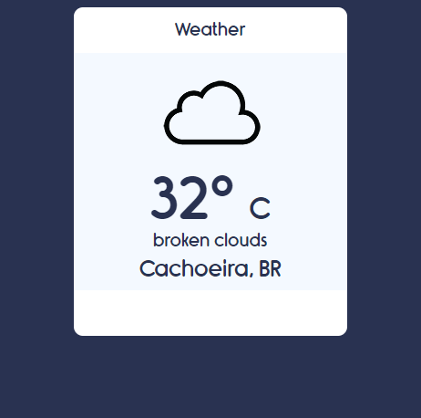

# Weather App
## Simple system to show the Weather by Geolocation, using API.

following this tutorial
### With the following features

* Current Weather Icon
* Degrees of Temperature
* Converter from ºC to ºF by clicking on temperature
* Weather Description
* City

### 🛠 Technologies

The following tools were used in the construction of the project:

* Javascript
* Geolocation (https://openweathermap.org/)

### How to Use

* Acess https://openweathermap.org/ and create a Login, then search a API KEY.
* Put you API KEY in main.js  

### Pictures 
  App View

<<<<<<< HEAD
  
=======
  

  Tutorial Link : https://www.youtube.com/watch?v=KqZGuzrY9D4
>>>>>>> 3918add...  How to Use
